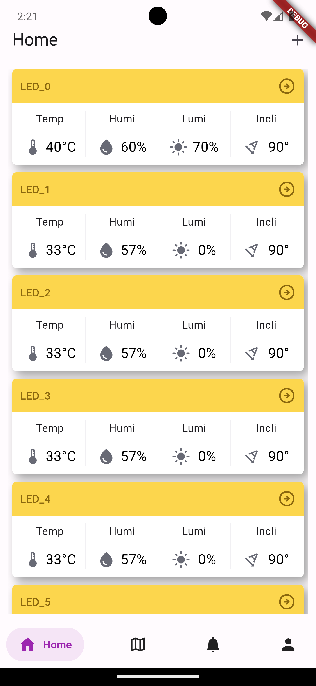
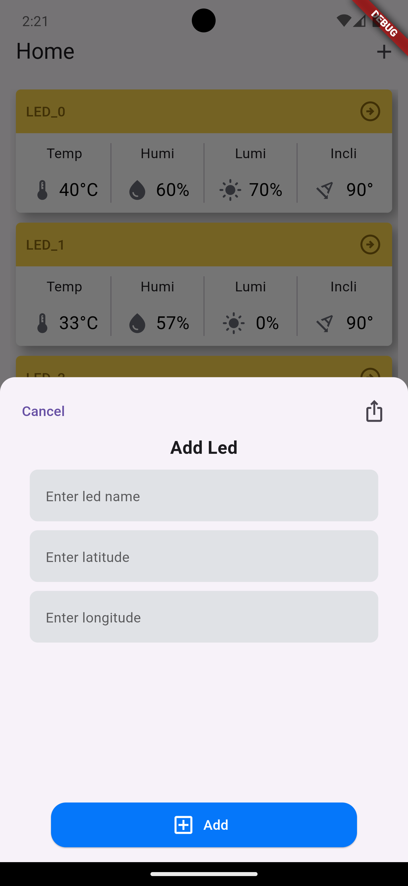
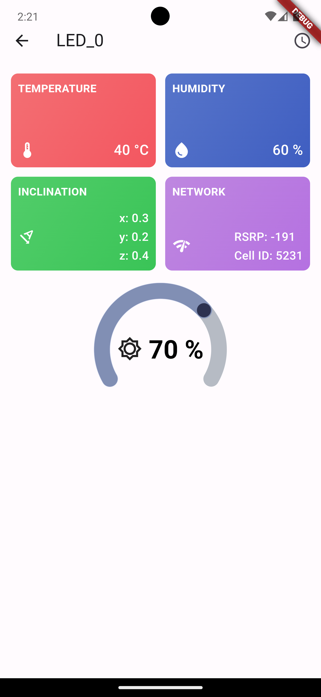
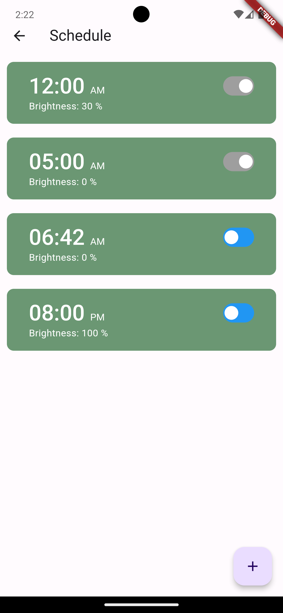
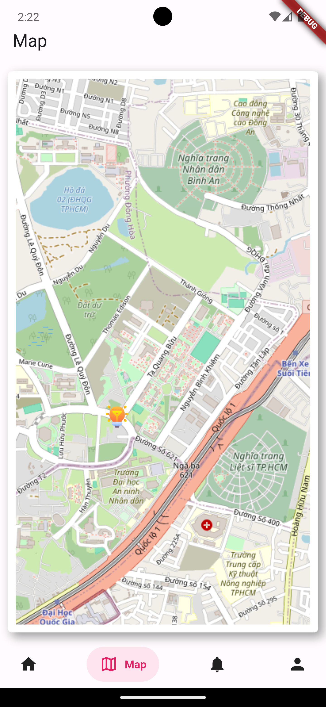
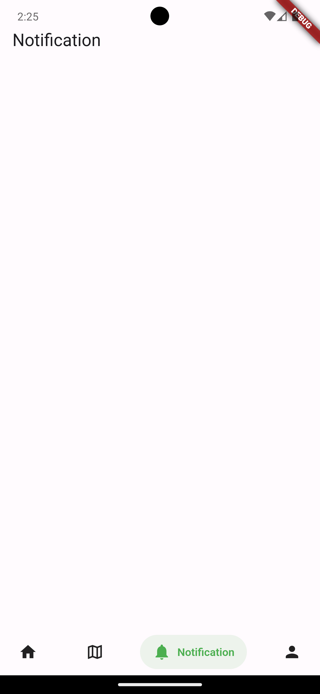
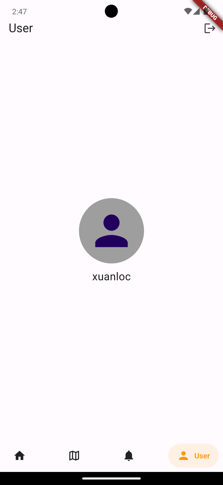
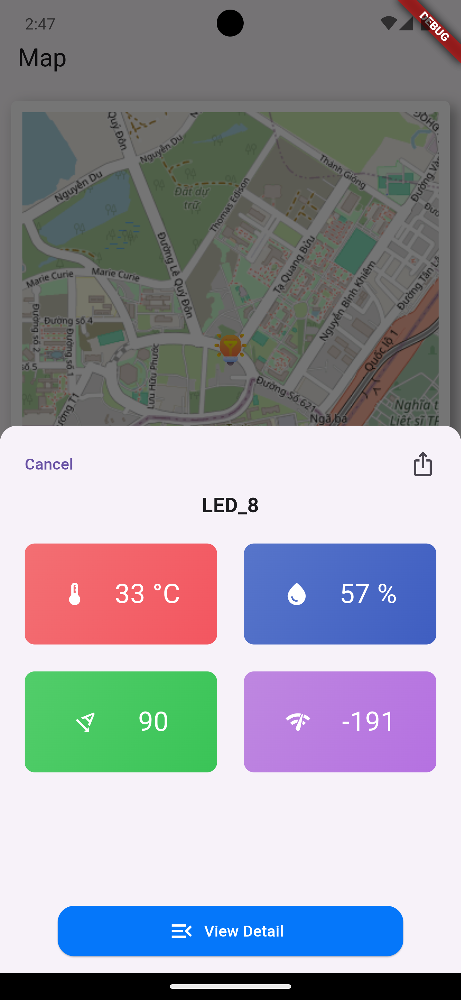

# 📖📖 LED Controller APP 

A Flutter app to control light street. 

## 💻 Requirements

- Any Operating System (ie. MacOS X, Linux, Windows)
- Any IDE with Flutter SDK installed (ie. IntelliJ, Android Studio, VSCode etc)
- A little knowledge of Dart and Flutter

## ✨ Features

- [x] Display infomation of light street (temp, humi,...).
- [x] Remote brightness control.
- [x] Add new led.
- [x] Set schedule.

## 📸 ScreenShots


| Light                             | Dark                              |
| --------------------------------- | --------------------------------- |
|   |   |
|   |   |
|   |   |
|   |   |

## 🔌 Plugins

| Name                                                                   | Usage                                         |
| ---------------------------------------------------------------------- | --------------------------------------------- |
| [**Provider**]              | State Management                              |
| [**MongoDB**]                        | NoSQL database |
| [**Node.js**]                      | Create server                           |
| [**Http**]                          | Network calls and File Download               |

## Setup

```bash
git clone https://github.com/dinkmsd/express_server.git

cd led_control_mobile

flutter pub get

flutter run
```

